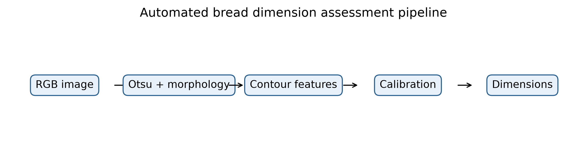
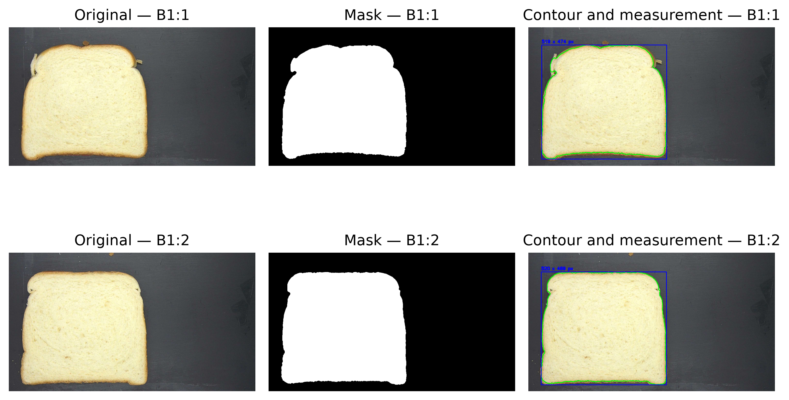
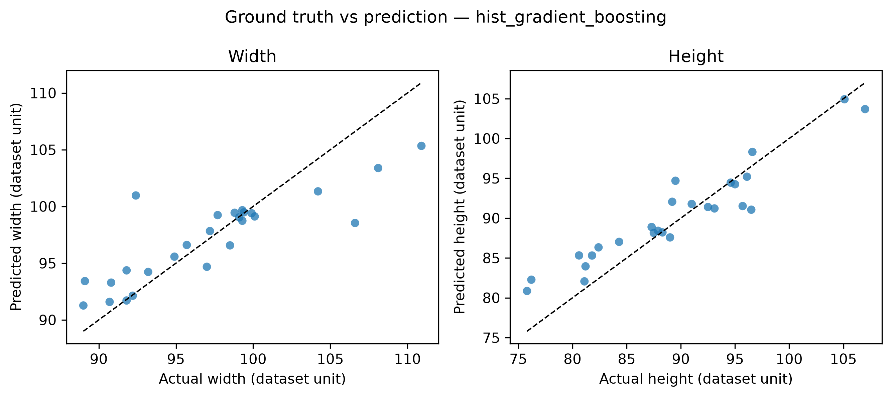
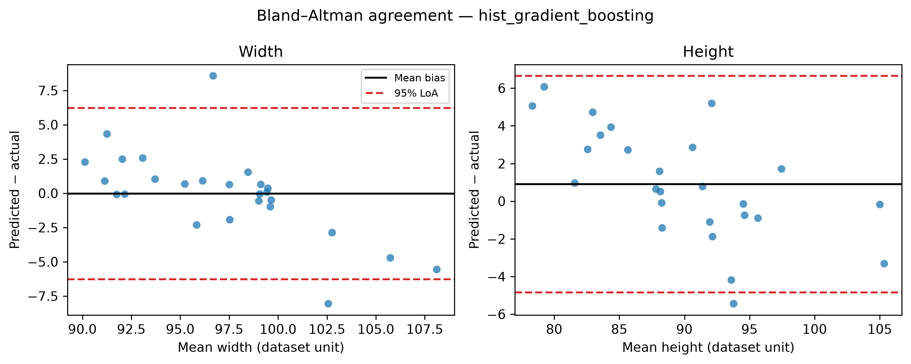
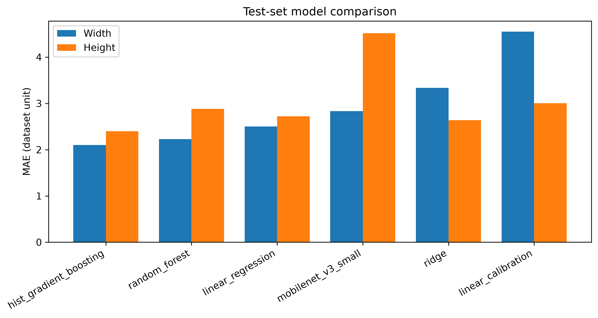

# Автоматизированная бесконтактная оценка размеров и формы хлебобулочных изделий по RGB-изображениям

## Аннотация

Разработан воспроизводимый pipeline бесконтактной оценки ширины, высоты и количественных
характеристик формы хлебобулочных изделий по RGB-изображениям. До моделирования выполнен аудит
набора Mendeley Data v1 (DOI 10.17632/f663p7c89m.1). Из 173 строк CSV пригодными признаны 171
однозначно сопоставленных физических образцов; конфликтующие записи исключены без ручного
исправления, после чего зафиксировано групповое разбиение 70/15/15. Сегментация объединяет
Gaussian blur, порог Отсу, морфологические операции и контроль контура. Линейная pixel-to-mm
калибровка сравнена с линейной, ridge-, Random Forest- и HistGradientBoosting-регрессией по
морфологическим признакам. По validation MAE выбран метод hist_gradient_boosting. На 26 независимых тестовых
образцах MAE ширины составила 2.10, MAE высоты — 2.40, RMSE — 3.12 и
3.02, R² — 0.694 и 0.847 соответственно в номинальных миллиметрах набора.
Классическая обработка заняла 4.3 мс/изображение на CPU. Все числа автоматически связаны
с predictions и metrics; ограничения метаданных и внешней валидности сохранены явно.

**Ключевые слова:** компьютерное зрение; хлеб; неразрушающие измерения; обработка изображений;
машинное обучение; контроль качества; Bland--Altman.

## 1. Введение

Ручной контроль размеров хлебобулочных изделий плохо масштабируется и даёт лишь выборочную
информацию о процессе. RGB-камера позволяет выполнять дешёвое бесконтактное измерение, однако
точность зависит от освещения, ракурса, масштаба и прослеживаемости измерений. Обзоры методов
визуального контроля хлеба отмечают широкий набор цветовых, текстурных и геометрических
признаков, но также недостаток стандартизации и воспроизводимости [16,17]. Gaussian blur, Otsu,
морфология и OpenCV уже использовались для хлеба [2,5], поэтому в данной работе они рассматриваются
как baseline.

Цель работы — разработать и проверить автоматический воспроизводимый pipeline оценки ширины,
высоты и формы хлеба, сравнив простую линейную калибровку с обучаемой регрессией и связав каждое
утверждение с сохранёнными результатами. Гипотеза H1 состоит в том, что морфологические признаки
снижают ошибку относительно одномерной pixel-to-mm калибровки; её статус определяется только
вычислительным экспериментом.

**Рисунок 1.** Полный процесс от аудита версионированного набора данных и группового разбиения до
сегментации, извлечения признаков, выбора модели, финальной оценки и формирования материалов
исследования. Независимая test-выборка используется только после выбора метода по validation.

## 2. Материалы и методы

### 2.1 Набор данных

Использован официальный набор Mora [1] под лицензией CC BY 4.0; изображения не включены в Git.
Заявленные авторами 1 635 изображений не принимались за объём размерной выборки. `Data.csv`
содержит 173 строки и отдельные имена изображений для width/height и thickness. Повторяющееся имя
с конфликтующими размерами сделало две строки неоднозначными; они исключены консервативно. Для
основной задачи осталось 171 образцов. Производные цветовые crops не смешивались с исходными
изображениями. CSV не кодирует единицы; значения интерпретированы как номинальные миллиметры,
что отмечено как ограничение.

### 2.2 Обработка и признаки

После grayscale и Gaussian blur порог Отсу [12] оценивался для обеих полярностей. Opening и
closing подавляли малые объекты, затем выбирался крупнейший допустимый контур. Сохранялись mask,
контур, bounding box, служебные флаги и время. Рассчитывались width/height в пикселях, area,
perimeter, aspect ratio, circularity, solidity, extent, equivalent diameter, а при наличии пяти
точек — оси эллипса и eccentricity. Искусственные классы качества формы не вводились.

**Рисунок 2.** Примеры исходных фотографий из размерной части набора, автоматически полученных
бинарных масок и контуров с измерениями ширины и высоты. Неровности корки сохраняются в контуре,
а не заменяются идеализированной геометрической фигурой.

### 2.3 Эксперимент

Физические sample ID разделены на train/validation/test в долях 70/15/15 при seed=42; пересечение
групп программно запрещено. Validation-кандидаты обучались только на train. После выбора метода
классические модели переобучались на train+validation перед однократной оценкой final test. Для
Method B сравнивались Linear Regression, Ridge, Random Forest [15] и
HistGradientBoostingRegressor. Ablation сопоставлял два пиксельных признака и полный набор
морфологии.

Для width и height вычислялись MAE, RMSE и R², bootstrap-интервалы MAE и парный Wilcoxon по общей
выборке. Согласие лучшего метода анализировалось по Bland--Altman [13], поскольку высокий R² сам
по себе не доказывает согласие измерений. CPU benchmark включал сегментацию и извлечение признаков.

## 3. Результаты и обсуждение

По validation MAE выбран **hist_gradient_boosting**. На 26 тестовых образцах MAE width=2.10,
height=2.40; RMSE width=3.12, height=3.02; R² width=0.694,
height=0.847. Полные метрики, интервалы, Bland--Altman, predictions и ablation находятся в
`reports/results.md` и `results/` и генерируются одним запуском. Среднее время классической
обработки — 4.3 мс/изображение. Статус lightweight CNN: `completed`; отсутствующий
эксперимент не подменяется положительным выводом.

**Рисунок 3.** Эталонные значения и прогнозы выбранной по validation модели на независимом test.
Пунктирная линия соответствует идеальному равенству и показывает сжатие прогнозов на крайних
значениях, особенно для наиболее широких образцов.

**Рисунок 4.** Анализ согласия Bland--Altman для ширины и высоты. Центральная линия показывает
среднее смещение, внешние линии — эмпирические 95%-е пределы согласия. Такой график дополняет R²,
показывая величину и разброс парных ошибок измерения.

**Рисунок 5.** Сравнение MAE линейной калибровки, регрессоров по морфологическим признакам и
MobileNetV3-Small на final test. Результат CNN сохранён как отрицательное сравнение: при данном
размере выборки компактная морфологическая модель оказалась точнее.

Различие ошибок по двум осям может быть связано с неправильной формой корки, поворотом и
чувствительностью axis-aligned bounding box. Морфологическая регрессия учитывает площадь и
компактность, но калибровка остаётся специфичной для камеры и стенда. Сопоставлять числа напрямую
с работами по нарезному хлебу [2], багетам [3] или RGB-D оценке еды [11] некорректно из-за разных
объектов, геометрии и целевых переменных.

## 4. Заключение

Получен воспроизводимый pipeline от аудита и автоматической сегментации до физической калибровки,
статистики согласия и CPU benchmark. Метод hist_gradient_boosting дал MAE 2.10 для ширины и 2.40
для высоты на независимом test в номинальных единицах CSV. Главные ограничения — отсутствие
явной единицы в CSV, конфликтующая запись, контролируемая съёмка и отсутствие внешней выборки.
Дальнейшая работа должна проверить новые камеры и изделия, добавить эталон масштаба, учесть
неопределённость инструментальных измерений и выполнять CNN-baseline только при достаточной
эффективной выборке.

## Литература

1. Mora J. *A dataset containing images of bread crumb and crust, along with measurements of size, color, and hardness*. Mendeley Data, version 1, 2025. [doi:10.17632/f663p7c89m.1](https://doi.org/10.17632/f663p7c89m.1).

2. Martínez-Lara N.-D., Garzón-Castro C. L., Filomena-Ambrosio A. Analysis of physical properties in white and whole wheat sliced bread using digital image processing. *Discover Food*, 5, 261, 2025. [doi:10.1007/s44187-025-00568-3](https://doi.org/10.1007/s44187-025-00568-3).

3. Dong C., Huang L., Xiong C., Li M., Tang J. Evaluation of quality of baguette bread using image analysis technique. *Journal of Food Composition and Analysis*, 140, 107222, 2025. [doi:10.1016/j.jfca.2025.107222](https://doi.org/10.1016/j.jfca.2025.107222).

4. Azmat M. et al. Assessing traits in bread using image analysis and machine learning. *Food Research International*, 235, 119131, 2026. [doi:10.1016/j.foodres.2026.119131](https://doi.org/10.1016/j.foodres.2026.119131).

5. Lee J., Kim Y., Kim S. The Study of an Adaptive Bread Maker Using Machine Learning. *Foods*, 12(22), 4160, 2023. [doi:10.3390/foods12224160](https://doi.org/10.3390/foods12224160).

6. Gonzalez Viejo C., Harris N. M., Fuentes S. Quality Traits of Sourdough Bread Obtained by Novel Digital Technologies and Machine Learning Modelling. *Fermentation*, 8(10), 516, 2022. [doi:10.3390/fermentation8100516](https://doi.org/10.3390/fermentation8100516).

7. Olakanmi S. J. et al. Quality Characterization of Fava Bean-Fortified Bread Using Hyperspectral Imaging. *Foods*, 13(2), 231, 2024. [doi:10.3390/foods13020231](https://doi.org/10.3390/foods13020231).

8. Ruderman M., Howell K. A., Appels R. Digital image analysis to assess the texture of bread products. *Applied Food Research*, 5(2), 101447, 2025. [doi:10.1016/j.afres.2025.101447](https://doi.org/10.1016/j.afres.2025.101447).

9. Torres J. D. et al. Non-invasive microstructural characterization and in vivo glycemic response of white bread formulated with soluble dietary fiber. *Food Bioscience*, 61, 104505, 2024. [doi:10.1016/j.fbio.2024.104505](https://doi.org/10.1016/j.fbio.2024.104505).

10. Nallan Chakravartula S. S. et al. Computer vision-based smart monitoring and control system for food drying: A study on carrot slices. *Computers and Electronics in Agriculture*, 206, 107654, 2023. [doi:10.1016/j.compag.2023.107654](https://doi.org/10.1016/j.compag.2023.107654).

11. Gonzalez B. et al. Automated Food Weight and Content Estimation Using Computer Vision and AI Algorithms. *Sensors*, 24(23), 7660, 2024. [doi:10.3390/s24237660](https://doi.org/10.3390/s24237660).

12. Otsu N. A Threshold Selection Method from Gray-Level Histograms. *IEEE Transactions on Systems, Man, and Cybernetics*, 9(1), 62–66, 1979. [doi:10.1109/TSMC.1979.4310076](https://doi.org/10.1109/TSMC.1979.4310076).

13. Bland J. M., Altman D. G. Statistical methods for assessing agreement between two methods of clinical measurement. *The Lancet*, 327(8476), 307–310, 1986. [doi:10.1016/S0140-6736(86)90837-8](https://doi.org/10.1016/S0140-6736(86)90837-8).

14. Howard A. et al. Searching for MobileNetV3. *Proceedings of the IEEE/CVF International Conference on Computer Vision*, 1314–1324, 2019. [doi:10.1109/ICCV.2019.00140](https://doi.org/10.1109/ICCV.2019.00140).

15. Breiman L. Random Forests. *Machine Learning*, 45, 5–32, 2001. [doi:10.1023/A:1010933404324](https://doi.org/10.1023/A:1010933404324).

16. Olakanmi S. J., Jayas D. S., Paliwal J. Applications of imaging systems for the assessment of quality characteristics of bread and other baked goods: A review. *Comprehensive Reviews in Food Science and Food Safety*, 22(3), 1817–1838, 2023. [doi:10.1111/1541-4337.13131](https://doi.org/10.1111/1541-4337.13131).

17. Martínez-Lara N.-D., Filomena-Ambrosio A., Garzón-Castro C. L. Use of computer vision systems in baked products: potential tool for measuring physical properties. *Journal of Food Measurement and Characterization*, 20, 6925–6947, 2026. [doi:10.1007/s11694-026-04154-8](https://doi.org/10.1007/s11694-026-04154-8).

Те же проверенные записи доступны в машиночитаемом формате BibTeX в файле
`references.bib`.
